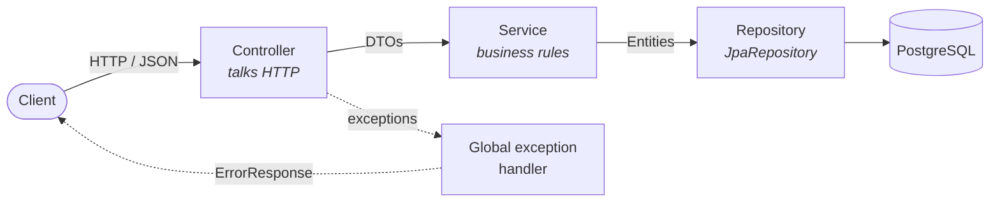

<div align="center">

# 📚 Book API

**A book-keeping REST API built with Spring Boot, PostgreSQL and Docker, deployed on Render.**

A hands-on project for learning **layered architecture**, **OOP** and **SOLID**, one phase at a time.


[Quick start](#-quick-start) · [Endpoints](#-endpoints) · [Architecture](#-architecture) · [Roadmap](#-roadmap) · [Docs](#-documentation)

</div>

---

## ✨ Overview

Book API manages a small library catalogue: books, and later members and loans. The goal
isn't only to ship endpoints but to build them *properly*:

- 🧱 **Layered**: controller → service → repository → entity, each with one job
- 🔒 **Encapsulated**: entity fields are private and only reachable through the entity's own methods
- 🔌 **Dependency-inverted**: constructor injection with `final` fields, interfaces all the way down
- 📦 **DTOs at the boundary**: entities never leak over HTTP
- 🐳 **Container-first**: one multi-stage Docker image, configured entirely by environment variables

> **Status:** 🚧 In active development. Deployment and the entity/repository layers are done;
> the REST endpoints are being built now. See the [roadmap](#-roadmap).

---

## 🛠 Tech stack

| Layer | Technology |
|---|---|
| Language | Java 25 |
| Framework | Spring Boot 4.1.1 (Web MVC, Data JPA, Validation, Actuator) |
| Database | PostgreSQL 18 |
| Build | Maven (via the `./mvnw` wrapper, so no install needed) |
| Container | Docker, multi-stage (Temurin JDK → JRE, non-root user) |
| Hosting | Render (Docker runtime + managed Postgres) |

---

## 🚀 Quick start

### Prerequisites

- **Docker** with Compose
- **JDK 25** (only if you run the app outside Docker)

### Option A: everything in Docker (zero config)

```bash
git clone git@github.com:Freeleaf-Labs/java-book-api.git
cd java-book-api/book
docker compose up --build
```

The API is now on **http://localhost:8080**.

### Option B: Postgres in Docker, app from your IDE (fast feedback)

```bash
cd book
docker compose up -d postgres

SPRING_DATASOURCE_URL=jdbc:postgresql://localhost:5434/bookdb \
SPRING_PROFILES_ACTIVE=dev \
./mvnw spring-boot:run
```

> ⚠️ **Port note:** the Docker Postgres is published on host port **5434**, not 5432, so it
> doesn't clash with a locally installed Postgres. Point your DB client at `localhost:5434`
> (user `book`, password `book`, database `bookdb`).

### Check it's alive

```bash
curl localhost:8080/                  # service info
curl localhost:8080/actuator/health   # {"status":"UP"}
```

---

## 📡 Endpoints

| Method | Path | Description | Status |
|---|---|---|:---:|
| `GET` | `/` | Service name, status and links | ✅ |
| `GET` | `/actuator/health` | Health check (used by Render) | ✅ |
| `GET` | `/api/v1/books` | List all books | ✅ |
| `GET` | `/api/v1/books/{id}` | Get one book (`404` if missing) | ✅ |
| `POST` | `/api/v1/books` | Create a book (`201` + `Location`) | 🚧 |
| `PUT` | `/api/v1/books/{id}` | Update a book | 🚧 |
| `DELETE` | `/api/v1/books/{id}` | Delete a book (`204`) | 🚧 |

<details>
<summary><b>Example request (once the book endpoints land)</b></summary>

```bash
curl -s -X POST localhost:8080/api/v1/books \
  -H 'Content-Type: application/json' \
  -d '{
        "title": "Clean Code",
        "author": "Robert C. Martin",
        "publisher": "Prentice Hall",
        "publishedYear": "2008",
        "isbn": "9780132350884"
      }'
```

Errors always come back in one consistent JSON shape:

```json
{
  "timestamp": "2026-09-29T08:15:30Z",
  "status": 404,
  "error": "Not Found",
  "message": "Book with id 999 not found"
}
```

</details>

---

## 🏛 Architecture



Each layer has exactly one reason to change: the controller when the API changes, the
service when the rules change, the repository when storage changes.

### Project layout

```
java-book-api/
├── README.md
├── PROJECT_GUIDE.md          # learning guide + phase-by-phase build checklist
├── DOCKER_DEPLOY.md          # JAR, Docker and Render deployment notes
└── book/
    ├── Dockerfile            # multi-stage: JDK build → JRE runtime
    ├── compose.yaml          # local Postgres 18 (+ app)
    ├── pom.xml
    └── src/main/java/np/com/milapmagar/book/
        ├── BookApplication.java
        ├── RootController.java      # GET /
        ├── controller/              # HTTP layer
        ├── services/                # business logic
        ├── repository/              # Spring Data JPA interfaces
        ├── model/                   # JPA entities (Book)
        ├── dto/                     # request/response shapes
        └── exception/               # custom exceptions + ErrorResponse
```

---

## ⚙️ Configuration

Everything is driven by environment variables, with safe local defaults in
`application.yaml`. No secrets are committed.

| Variable | Default | Purpose |
|---|---|---|
| `PORT` | `8080` | HTTP port (Render sets this automatically) |
| `SPRING_DATASOURCE_URL` | `jdbc:postgresql://localhost:5432/bookdb` | JDBC URL |
| `SPRING_DATASOURCE_USERNAME` | `book` | DB user |
| `SPRING_DATASOURCE_PASSWORD` | `book` | DB password |
| `SPRING_JPA_HIBERNATE_DDL_AUTO` | `update` | Schema strategy (`validate` once Flyway lands) |
| `SPRING_PROFILES_ACTIVE` | none | `dev` locally, `prod` on Render |

---

## ☁️ Deployment

Pushing to `main` triggers an automatic redeploy on Render:

```
git push  →  Render builds the Dockerfile  →  health check /actuator/health  →  live
```

Render settings: **Runtime** Docker · **Root Directory** `book` · **Health Check Path**
`/actuator/health`. The full walkthrough is in [`DOCKER_DEPLOY.md`](DOCKER_DEPLOY.md).

> 💤 Free tier: the service sleeps after ~15 minutes idle, so the first request afterwards can
> take 30–60 s while the JVM cold-starts.

---

## 🗺 Roadmap

- [x] **Phase 0–1**: project baseline and package structure
- [x] **Phase D**: Dockerfile, Compose, env-var config, Render deployment
- [x] **Phase 2**: `Book` entity with encapsulated behaviour
- [x] **Phase 3**: `BookRepository` with derived queries
- [ ] **Phase 4**: request/response DTOs with validation
- [ ] **Phase 5**: `BookService` (transactional, zero web imports)
- [ ] **Phase 6**: `BookController` + global exception handling
- [ ] **Phase 7**: Flyway migrations, `ddl-auto: validate`
- [ ] **Phase 8**: unit, web-layer and Testcontainers integration tests
- [ ] **Phase 9**: Open/Closed in practice (pluggable exporters, pagination)
- [ ] **Phase 10**: `Member` and `Loan` entities with borrow/return transactions

---

## 🧪 Testing

```bash
cd book
./mvnw test
```

---

## 📖 Documentation

| File | What's inside |
|---|---|
| [`PROJECT_GUIDE.md`](PROJECT_GUIDE.md) | How Spring Boot works, OOP and SOLID mapped onto this code, and the build checklist |
| [`DOCKER_DEPLOY.md`](DOCKER_DEPLOY.md) | What a JAR is, the Dockerfile line by line, and deploying to Render |

---

<div align="center">

Built by **Milap Magar** · [Freeleaf Labs](https://github.com/Freeleaf-Labs)

</div>
